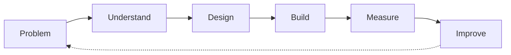
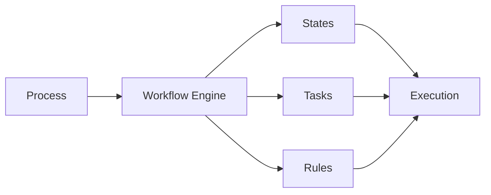

<!-- =========================================================
     ALHARETH AL-DAHIYA — GITHUB PROFILE
     Software Engineering · AI · Computer Vision
========================================================== -->

Information Technology Student

"Software Engineering" · "Artificial Intelligence" · "Computer Vision"

 

---

# About Me

I am an Information Technology student interested in building software and intelligent systems from first principles.

My current focus:

---

## Engineering Process

---

## Engineering Areas

<table>
<tr>
<td align="center" width="33%">

### Software

- Backend
- Architecture
- Databases
- APIs

</td>
<td align="center" width="33%">

### AI & Vision

- Machine Learning
- Computer Vision
- YOLO
- OCR

</td>
<td align="center" width="33%">

### Engineering Tools

- Git
- Docker
- Linux
- Experimentation

</td>
</tr>
</table>

---

## Selected Projects

### 01 · Historical Document AI

Computer vision pipeline for detecting and analyzing historical text regions.

Keywords: YOLOv8 · Synthetic Data · Object Detection · Image Processing

---

### 02 · Human Proctoring Assistant

Computer vision system that generates signals to assist human examination monitoring.

Keywords: Real-Time Vision · YOLO · Human-in-the-Loop

---

### 03 · Adaptive Workflow Engine

Software architecture concept for state-driven organizational workflows.

Keywords: System Design · State Machines · Business Rules · Workflow Modeling

---
## 📝 Latest Articles
<!-- BLOG-POST-LIST:START -->
- [Building Intelligent Building Intelligent Systems from First Principles: Why Architecture Beats Complexity](https://dev.to/alhareith/building-intelligent-building-intelligent-systems-from-first-principles-why-architecture-beats-22h9)
<!-- BLOG-POST-LIST:END -->

## Tech Stack

**Languages**

**Backend & Databases**

**AI & Computer Vision**

**Tools**

---

## How I Think

1. Problem
2. Understand
3. Design
4. Build
5. Measure
6. Improve

> «Simple architecture before unnecessary complexity.
> Evidence before assumptions.
> Understand before implementing.»

  
  

  

  

  

Build systems. Study failures. Improve continuously.

Eng. Alhareth Al-Dahiya

"Software Engineering × Artificial Intelligence"

  

