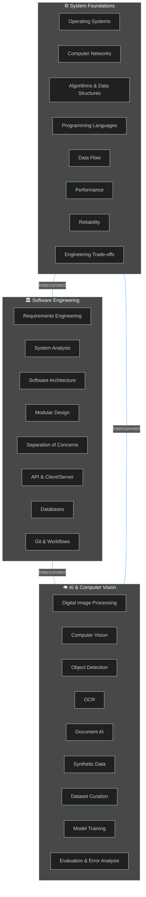
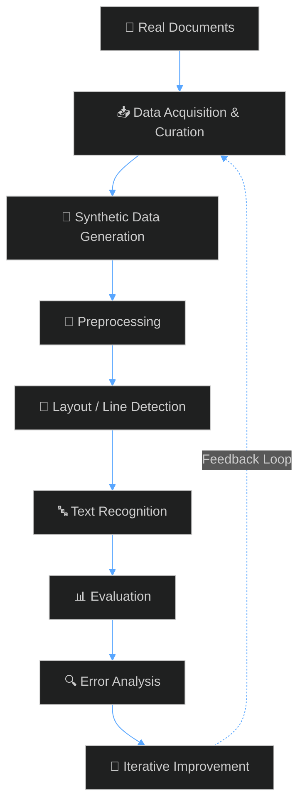
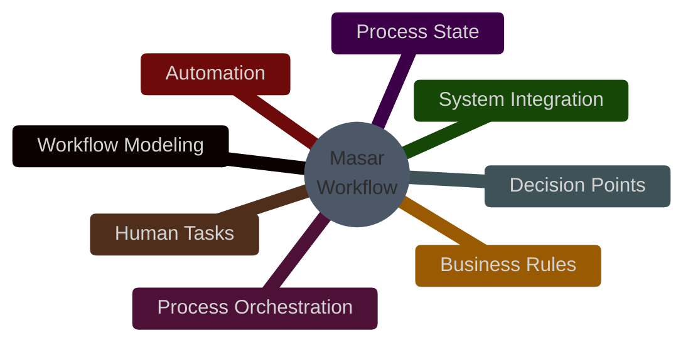
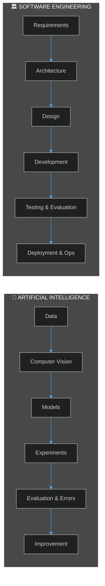

<!-- =========================================================
     ALHARETH AL-DAHIYA — GITHUB PROFILE
     Engineering Portfolio · Systems · AI · Computer Vision
     redesigned by creative dark-engineering aesthetic
========================================================== -->

<div align="center">

<!-- ═══════════════════════════════════════════════════════════
     HERO SECTION — CINEMATIC SVG BACKGROUND
     ═══════════════════════════════════════════════════════════ -->


<br>

<!-- ═══════════════════════════════════════════════════════════
     TYPING SVG — DYNAMIC TAGLINE
     ═══════════════════════════════════════════════════════════ -->

[](https://git.io/typing-svg)

<br>

<!-- ═══════════════════════════════════════════════════════════
     SOCIAL BADGES — NEON GLOW STYLE
     ═══════════════════════════════════════════════════════════ -->

[](https://github.com/Alhareth)
[](https://www.linkedin.com/in/%D8%A7%D9%84%D8%AD%D8%A7%D8%B1%D8%AB-%D8%A7%D9%84%D8%AF%D8%A7%D9%87%D9%8A%D8%A9-95b4a831a)
[](https://huggingface.co/Alhareth7790)

</div>

---

<!-- ═══════════════════════════════════════════════════════════
     01 — ABOUT — GLASSMORPHISM CARD
     ═══════════════════════════════════════════════════════════ -->

<h2 align="center">
   
  01 — About
</h2>

<div align="center">

<table width="90%">
<tr>
<td width="100%" align="center">

> **I am an Information Technology student** focused on understanding how software systems and intelligent systems are designed, built, evaluated, and evolved.

My interests have gradually moved beyond writing code toward the engineering questions behind the code:

</td>
</tr>
</table>

</div>

<div align="center">

| | Engineering Questions |
|:---:|---|
| 🔍 | How should a problem be defined before implementation? |
| 🏗️ | How should requirements become a system architecture? |
| ⚖️ | Where should complexity exist — and where should it not? |
| 🌊 | How should data move through a system? |
| 📊 | How do we measure whether a system actually works? |
| 🔄 | How can a prototype evolve into a maintainable product? |

</div>

<br>

<div align="center">

```diff
+ My current technical direction sits at the intersection of:
```

</div>

<div align="center">

<table>
<tr>
<td align="center" width="280">

### `Software Engineering`
### `×`
### `System Design`

</td>
<td align="center" width="40">

<br>

</td>
<td align="center" width="280">

### `Artificial Intelligence`
### `×`
### `Computer Vision`

</td>
<td align="center" width="40">

<br>

</td>
<td align="center" width="280">

### `Document AI`

</td>
</tr>
</table>

</div>

<br>

<div align="center">

> [!IMPORTANT]
> I am more interested in understanding **why a system is designed a certain way** than simply learning another framework.

</div>

---

<!-- ═══════════════════════════════════════════════════════════
     02 — ENGINEERING DIRECTION — MERMAID DIAGRAM
     ═══════════════════════════════════════════════════════════ -->

<h2 align="center">
   
  02 — Engineering Direction
</h2>

<div align="center">

My development is organized around three connected layers.

</div>



---

<!-- ═══════════════════════════════════════════════════════════
     03 — SELECTED PROJECTS
     ═══════════════════════════════════════════════════════════ -->

<h2 align="center">
   
  03 — Selected Projects
</h2>

<div align="center">

These are the projects that best represent the direction I am currently developing.

</div>

---

##  01 / Tibetan OCR & Document AI

### `Historical Tibetan Document Recognition`

**Status:** `Active Research & Development`

A computer vision and OCR research project focused on recognizing **printed Old Tibetan/Uchen documents**.

The project is not treated as simply "training an OCR model". It is being designed as a complete engineering pipeline:



### Engineering Focus

<div align="center">

| Domain | Capabilities |
|---|---|
| Data | Synthetic dataset generation, Real-data curation, Tibetan Uchen typography |
| Vision | Document preprocessing, Layout and line detection, YOLO-based detection/segmentation |
| NLP | Sequence recognition, Syllable / grapheme-cluster tokenization |
| Metrics | CER / WER evaluation, Controlled experimentation, Real-vs-synthetic data analysis |

</div>

### Current Architecture Direction

```mermaid
%%{init: {'theme': 'dark', 'themeVariables': { 'primaryColor': '#161b22', 'primaryTextColor': '#c9d1d9', 'primaryBorderColor': '#30363d', 'lineColor': '#58a6ff', 'secondaryColor': '#21262d'}}}%%
flowchart TD
    DOC["📄 DOCUMENT"] --> LAYOUT["📐 Layout / Line Detection<br/>YOLO-based"]
    LAYOUT --> CROP["✂️ Line Cropping"]
    CROP --> RECOG["🔤 Text Recognition<br/>CRNN / TrOCR"]
    RECOG --> TEXT["📝 Tibetan Text"]
    TEXT --> EVAL["📊 Evaluation & Analysis"]
    
    style DOC fill:#0d1117,stroke:#58a6ff,stroke-width:3px,color:#fff
    style LAYOUT fill:#161b22,stroke:#238636,stroke-width:2px
    style RECOG fill:#161b22,stroke:#a371f7,stroke-width:2px
    style EVAL fill:#161b22,stroke:#d29922,stroke-width:2px
```



### Core Technologies

<div align="center">

`Python` · `PyTorch` · `YOLO` · `OpenCV` · `Pillow` · `Albumentations`

</div>

---

##  02 / Human Proctoring Assistant

### `Computer Vision Assistant for Exam Monitoring`

**Status:** `Project Development`

A computer-vision-based system designed to **assist a human proctor** in identifying potentially suspicious examination behavior.

> **Computer Vision detects signals; the human makes the final decision.**

### Initial Detection Scope

```mermaid
%%{init: {'theme': 'dark', 'themeVariables': { 'primaryColor': '#161b22', 'primaryTextColor': '#c9d1d9', 'primaryBorderColor': '#30363d', 'lineColor': '#58a6ff', 'secondaryColor': '#21262d'}}}%%
flowchart LR
    CAM["📹 Camera Input"] --> FRAME["⚙️ Frame Processing"]
    FRAME --> PHONE["📱 Phone Detection"]
    FRAME --> PAPER["📄 Paper Detection"]
    FRAME --> HEAD["👤 Head Pose Analysis"]
    PHONE --> SIG["⚠️ Suspicion Signals"]
    PAPER --> SIG
    HEAD --> SIG
    SIG --> HUMAN["👨‍🏫 Human Review"]
    
    style CAM fill:#0d1117,stroke:#58a6ff,stroke-width:3px
    style HUMAN fill:#161b22,stroke:#238636,stroke-width:3px
    style SIG fill:#161b22,stroke:#d29922,stroke-width:2px
```



The project therefore combines:

<div align="center">

`Computer Vision` · `Object Detection` · `Image Processing` · `Human-in-the-Loop Systems`

</div>

---

##  03 / Masar — Adaptive Workflow Management

### `Smart Adaptive Workflow Management`

A broader software-system concept exploring how organizational workflows can become more structured, observable, and adaptable.

The project examines ideas around:

<div align="center">



</div>

> **Do not introduce enterprise-level complexity unless the business problem actually requires it.**

This project is therefore also an exploration of the boundary between:

<div align="center">

`Simple Modular Systems` → `Workflow Engines` → `Process Orchestration Platforms`

</div>

---

##  04 / Interactive Computer Vision & Image Processing Platform

### `Computer Vision Learning & Experimentation Platform`

A long-term direction for building an educational and experimental platform centered around:

```mermaid
%%{init: {'theme': 'dark', 'themeVariables': { 'primaryColor': '#161b22', 'primaryTextColor': '#c9d1d9', 'primaryBorderColor': '#30363d', 'lineColor': '#58a6ff', 'secondaryColor': '#21262d'}}}%%
flowchart TB
    subgraph KNOWLEDGE["📚 Knowledge"]
        K1[Concepts]
        K2[Algorithms]
        K3[Papers]
        K4[Books]
        K5[Tools]
        K6[Projects]
    end
    
    KNOWLEDGE --> LABS["🧪 Interactive Labs"]
    LABS --> EXP["🔬 Experiments"]
    EXP --> AI["🤖 AI Assistance"]
    AI --> PATH["🎯 Learning Path"]
    PATH -.->|Continuous| KNOWLEDGE
    
    style KNOWLEDGE fill:#0d1117,stroke:#58a6ff,stroke-width:2px
    style PATH fill:#161b22,stroke:#238636,stroke-width:2px
```

<div align="center">



</div>

The long-term goal is to connect **knowledge, experimentation, projects, and intelligent learning assistance** within one coherent system.

---

<!-- ═══════════════════════════════════════════════════════════
     04 — TECHNICAL FOUNDATION
     ═══════════════════════════════════════════════════════════ -->

<h2 align="center">
   
  04 — Technical Foundation
</h2>

<div align="center">

My current stack is intentionally broader than a list of frameworks.

</div>

<div align="center">

| Category | Technologies |
|---|---|
| **Languages** | `Python` · `C++` · `C#` · `JavaScript` · `HTML` · `CSS` · `SQL` |
| **AI / ML** | `PyTorch` · `Scikit-learn` · `Pandas` |
| **Computer Vision** | `OpenCV` · `YOLO` · `Albumentations` |
| **Data & Experimentation** | `NumPy` · `Pandas` · `Jupyter` · `Google Colab` |
| **Software Engineering** | `OOP` · `Data Structures & Algorithms` · `REST Concepts` · `Client/Server Architecture` · `Database Design` |
| **Development Tools** | `Git` · `GitHub` · `VS Code` · `Visual Studio` |

</div>

---

<!-- ═══════════════════════════════════════════════════════════
     05 — WHAT I AM CURRENTLY BUILDING
     ═══════════════════════════════════════════════════════════ -->

<h2 align="center">
   
  05 — What I Am Currently Building
</h2>

<div align="center">

My current learning is not organized around collecting technologies.

It is organized around **capabilities**.

```mermaid
%%{init: {'theme': 'dark', 'themeVariables': { 'primaryColor': '#161b22', 'primaryTextColor': '#c9d1d9', 'primaryBorderColor': '#30363d', 'lineColor': '#58a6ff', 'secondaryColor': '#21262d'}}}%%
flowchart TB
    ENGINEERING["🏛️ ENGINEERING"] --> SE["💻 SOFTWARE ENGINEERING"]
    ENGINEERING --> AICV["🧠 AI / CV"]
    ENGINEERING --> SYS["⚙️ SYSTEMS"]
    
    SE --> SE1[Requirements]
    SE --> SE2[Architecture]
    SE --> SE3[APIs]
    SE --> SE4[Databases]
    SE --> SE5[Testing]
    
    AICV --> AI1[Data Pipelines]
    AICV --> AI2[Image Processing]
    AICV --> AI3[OCR]
    AICV --> AI4[Detection]
    AICV --> AI5[Evaluation]
    
    SYS --> S1[Networking]
    SYS --> S2[Operating Systems]
    SYS --> S3[Performance]
    SYS --> S4[Reliability]
    SYS --> S5[Deployment]
    
    SE1 & SE2 & SE3 & SE4 & SE5 --> COMPLETE["🎯 COMPLETE SYSTEMS"]
    AI1 & AI2 & AI3 & AI4 & AI5 --> COMPLETE
    S1 & S2 & S3 & S4 & S5 --> COMPLETE
    
    style ENGINEERING fill:#0d1117,stroke:#58a6ff,stroke-width:4px,color:#fff
    style COMPLETE fill:#161b22,stroke:#238636,stroke-width:4px,color:#fff
    style SE fill:#21262d,stroke:#a371f7,stroke-width:2px
    style AICV fill:#21262d,stroke:#d29922,stroke-width:2px
    style SYS fill:#21262d,stroke:#58a6ff,stroke-width:2px
```

</div>



<div align="center">

Current areas of deeper study include:

`Software Architecture` · `System Design` · `Client/Server Architecture` · `APIs and Data Flow` · `Computer Networks` · `Operating Systems` · `Digital Image Processing` · `Computer Vision` · `OCR Architecture` · `Dataset Engineering` · `Model Evaluation` · `Engineering Trade-offs` · `Git-based collaboration`

</div>

---

<!-- ═══════════════════════════════════════════════════════════
     06 — ENGINEERING PRINCIPLES
     ═══════════════════════════════════════════════════════════ -->

<h2 align="center">
   
  06 — Engineering Principles
</h2>

<div align="center">

> [!NOTE]
> These principles describe how I approach engineering problems, not claims that I have already mastered every area listed above.

</div>

<div align="center">

| # | Principle | Philosophy |
|:---:|:---|:---|
| `01` | **Understand Before Implementing** | A technically impressive solution is still a bad solution if the problem was misunderstood. |
| `02` | **Architecture Before Complexity** | Architecture exists to manage complexity. It should not become complexity itself. |
| `03` | **Evidence Over Assumptions** | Performance claims should come from measurements. Model improvements should come from experiments. Architectural decisions should have reasons. |
| `04` | **Build Small, Learn Fast** | A system should earn its complexity through real requirements. Start with a coherent foundation and evolve it deliberately. |
| `05` | **Data Is Part of the System** | In AI projects, the model is only one component. Dataset quality, labeling, preprocessing, evaluation, and error analysis are equally important. |
| `06` | **Failure Is Information** | A failed experiment is useful when it explains something about the system. |
| `07` | **Document Decisions** | Knowing **what** was built is not enough. A maintainable system should also preserve **why** it was built that way. |

</div>

---

<!-- ═══════════════════════════════════════════════════════════
     07 — LEARNING ARCHITECTURE
     ═══════════════════════════════════════════════════════════ -->

<h2 align="center">
   
  07 — Learning Architecture
</h2>

<div align="center">

My long-term learning path is structured around foundations rather than isolated technologies.

</div>

<div align="center">



</div>

<div align="center">

The goal is not to become dependent on a particular framework.

The goal is to understand the principles well enough to **learn new tools quickly and make sound engineering decisions**.

</div>

---

<!-- ═══════════════════════════════════════════════════════════
     08 — SELECTED AREAS OF PRACTICE
     ═══════════════════════════════════════════════════════════ -->

<h2 align="center">
   
  08 — Selected Areas of Practice
</h2>

<div align="center">

| Area | Current Direction |
|:---|:---|
| **Software Engineering** | System design, architecture, requirements, modularity |
| **Artificial Intelligence** | Machine learning, model evaluation, experimentation |
| **Computer Vision** | Detection, preprocessing, document analysis |
| **OCR** | Recognition pipelines, synthetic data, evaluation |
| **Image Processing** | Enhancement, filtering, segmentation, feature extraction |
| **Data Engineering** | Dataset construction, preprocessing, curation |
| **Systems** | Client/server, networking, operating-system foundations |
| **Collaboration** | Git, GitHub, structured workflows and documentation |

</div>

---

<!-- ═══════════════════════════════════════════════════════════
     09 — BEYOND TOOLS
     ═══════════════════════════════════════════════════════════ -->

<h2 align="center">
   
  09 — Beyond Tools
</h2>

<div align="center">

Frameworks change.

Libraries change.

Model architectures change.

**The engineering fundamentals remain.**

</div>

<div align="center">

What I am deliberately trying to build is the ability to:

</div>

<div align="center">


</div>

<div align="center">

> [!TIP]
> The real objective is not to know more technologies.
>
> It is to become better at **learning, designing, building, evaluating, and improving systems**.

</div>

---

<!-- ═══════════════════════════════════════════════════════════
     10 — LONG-TERM DIRECTION
     ═══════════════════════════════════════════════════════════ -->

<h2 align="center">
   
  10 — Long-Term Direction
</h2>

<div align="center">

My long-term direction is toward **software and intelligent systems engineering**, with particular interest in:

```mermaid
%%{init: {'theme': 'dark', 'themeVariables': { 'primaryColor': '#161b22', 'primaryTextColor': '#c9d1d9', 'primaryBorderColor': '#30363d', 'lineColor': '#58a6ff', 'secondaryColor': '#21262d'}}}%%
flowchart TB
    A["💻 Software Engineering"] --> B["🏗️ System Architecture"]
    B --> C["🧠 Artificial Intelligence"]
    C --> D["👁️ Computer Vision"]
    D --> E["📄 Document AI"]
    E --> F["🔬 Research & Experimentation"]
    
    style A fill:#0d1117,stroke:#58a6ff,stroke-width:3px
    style F fill:#161b22,stroke:#238636,stroke-width:3px
```

</div>

<div align="center">



</div>

<div align="center">

I am especially interested in problems where software engineering and AI meet:

`Intelligent document processing` · `OCR systems` · `Computer vision pipelines` · `Human-in-the-loop systems` · `Data-centric AI` · `Knowledge and learning systems` · `Scalable software platforms`

</div>

<div align="center">

The objective is not to build projects for the sake of having projects.

It is to use projects as increasingly difficult engineering problems through which deeper understanding is developed.

</div>

---

<!-- ═══════════════════════════════════════════════════════════
     FOOTER — CINEMATIC CLOSING
     ═══════════════════════════════════════════════════════════ -->

<div align="center">


<br>

### Understand → Design → Build → Measure → Improve

<br>

**Alhareth Al-Dahiya**

*Software Engineering · AI · Computer Vision · Systems*

<br>

[](https://github.com/Alhareth)
[](https://www.linkedin.com/in/%D8%A7%D9%84%D8%AD%D8%A7%D8%B1%D8%AB-%D8%A7%D9%84%D8%AF%D8%A7%D9%87%D9%8A%D8%A9-95b4a831a)
[](https://huggingface.co/Alhareth7790)

</div>
