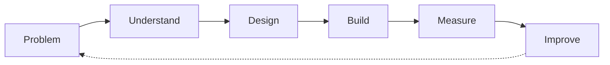

<!-- =========================================================
     ALHARETH AL-DAHIYA — GITHUB PROFILE
     Software Engineering · AI · Computer Vision
========================================================== -->

### Information Technology Student · Software Engineering · AI

I am an Information Technology student who builds practical projects in **software engineering**, **artificial intelligence**, and **computer vision**. I enjoy turning real problems into clear, testable, and useful systems.

> Open to internships, junior opportunities, and meaningful collaborations in software engineering and applied AI.

 

  

---

## About Me

I am a fourth-level Bachelor of Information Technology student with a strong interest in programming, artificial intelligence, and practical system development.

My work includes personal projects and two team projects. **Fraud Detection with synthetic data** and **Fitra** are the team projects in this profile. The synthetic-data Fraud Detection project was completed by a five-person team, and I was responsible for the project, fraud-detection work, and results analysis. In Fitra, I was responsible for the project and my assigned part.

My **Fraud Detection project with real financial data** is a separate personal project. It is listed independently from the team project and is hosted under **HackingField**.

---

## Engineering Process

I follow a simple process: understand the problem, design a clear solution, build it, measure the result, and improve it.

---

## Engineering Areas

### Software

Backend · Architecture · Databases · APIs

### AI & Vision

Machine Learning · Computer Vision · YOLO · OCR

### Engineering Tools

Git · Docker · Linux · Experimentation

---

## Selected Projects

### 01 · Fraud Detection — Real Financial Transactions

**Personal project.** A system for analyzing real financial transactions and identifying possible fraud patterns. The work focuses on feature engineering, model development, and results analysis. Hosted under **HackingField**.

Real Data · Feature Engineering · Classification · Evaluation

### 02 · Fraud Detection — PaySim Transactions

**Team project.** A five-person team project for detecting fraud in synthetic PaySim transactions. I was responsible for the project, the fraud-detection work, and the analysis of the results.

Synthetic Data · XGBoost · Imbalanced Learning · SHAP

### 03 · Fitra

**Team project.** A collaborative project where I was responsible for the project and my assigned development work.

### 04 · Arabic News Classifier

An Arabic news classifier built with natural language processing and Transformer models.

Arabic NLP · CAMeLBERT · Text Classification

### 05 · Historical Document AI

A computer-vision pipeline for detecting text regions in historical documents.

YOLOv8 · Synthetic Data · OCR · Image Processing

### 06 · Manuscript Doctor

A web application for processing and improving the readability of Arabic document images.

Flask · OpenCV · NumPy · JavaScript

### 07 · TechCom Network

A three-tier enterprise network lab built with Cisco Packet Tracer.

HSRP · OSPF · BGP · VLANs · VoIP

---

## 📝 Latest Articles
<!-- BLOG-POST-LIST:START -->
- [Building Intelligent Building Intelligent Systems from First Principles: Why Architecture Beats Complexity](https://dev.to/alhareith/building-intelligent-building-intelligent-systems-from-first-principles-why-architecture-beats-22h9)
<!-- BLOG-POST-LIST:END -->

## Tech Stack

**Languages**

**Backend & Databases**

**AI & Computer Vision**

**Tools**

---

## Connect Me

---

## How I Think

1. Problem
2. Understand
3. Design
4. Build
5. Measure
6. Improve

> "Simple architecture before unnecessary complexity.
> Evidence before assumptions.
> Understand before implementing."

  
  

  

  

  

Build systems. Study failures. Improve continuously.

Eng. Alhareth Al-Dahiya

"Software Engineering × Artificial Intelligence"

  

